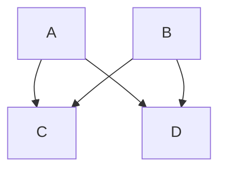
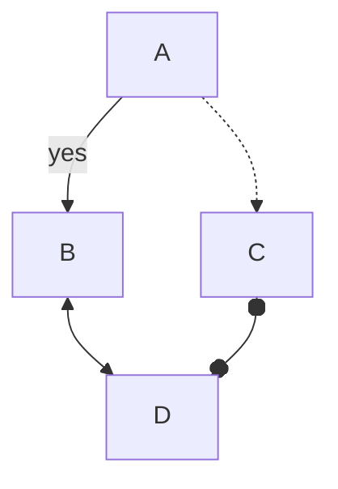
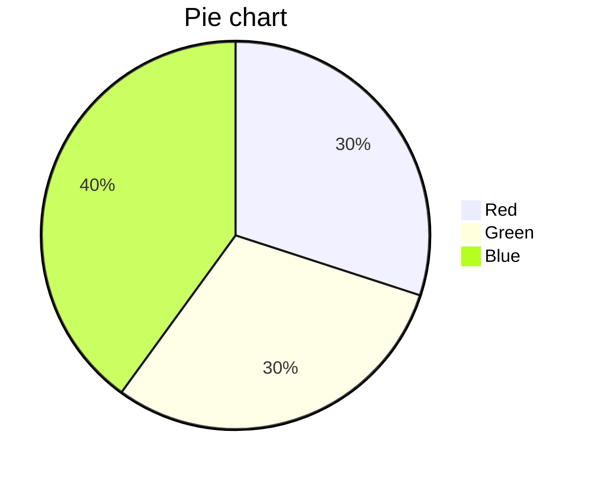
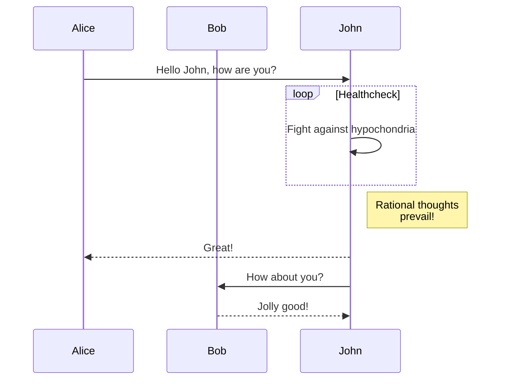
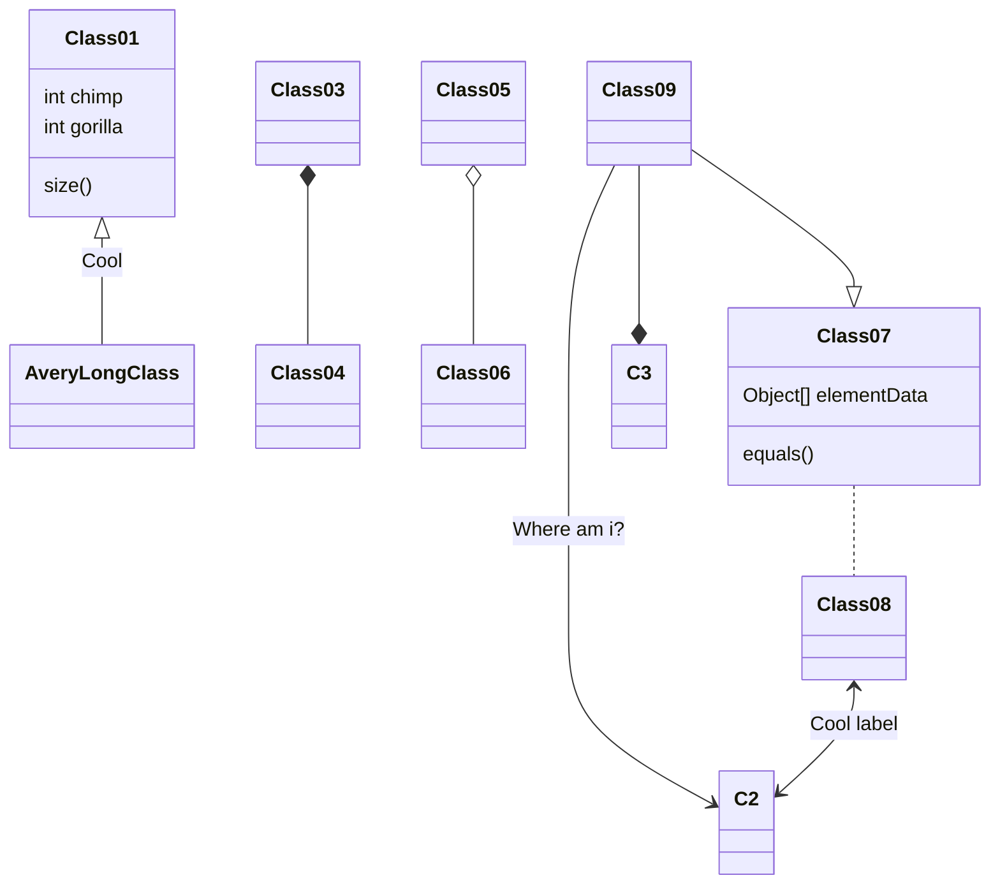
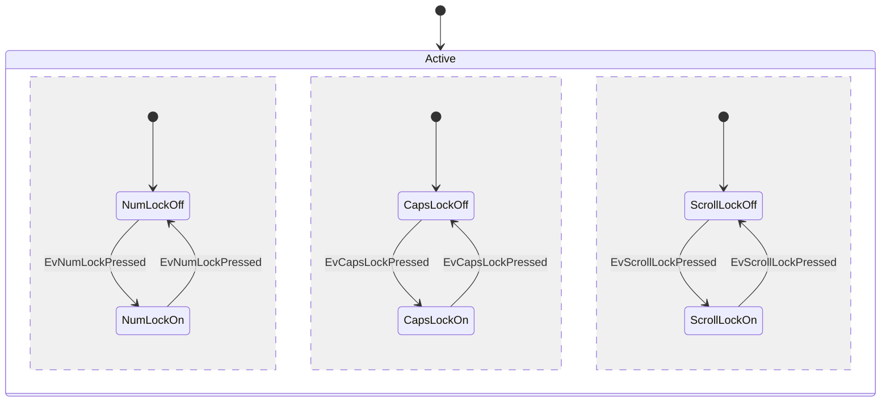
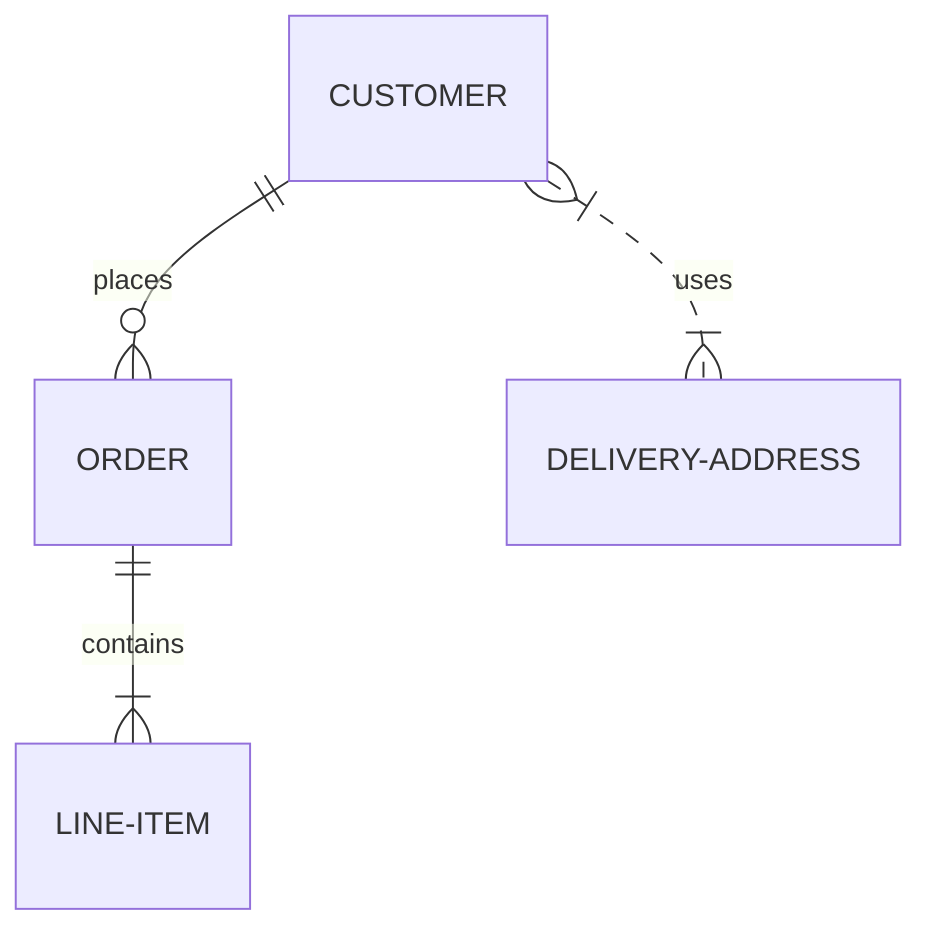
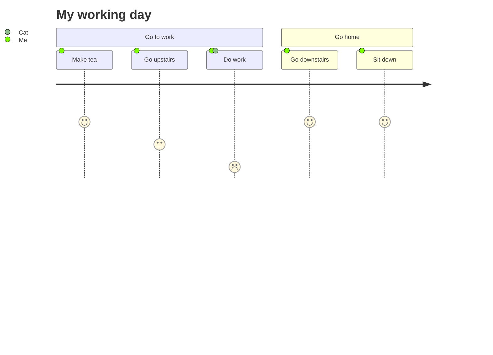

# Headline

> An awesome project.


# katex

[katex supported funtions](https://katex.org/docs/supported.html)

```tex
    E = mc^2
```

## formula

```tex
    y_x = 1
```


[mermaid](https://mermaid-js.github.io/mermaid/)

## flow chart



## flow chart2



## Graph


## Gantt

```mermaid
gantt
dateFormat YYYY-MM-DD
title Adding GANTT diagram to mermaid
excludes weekdays 2021-09-30

section A section
Completed task    :done,   des1,2021-09-20，2021-09-22
Active task       :active, des2,2021-09-23,3d
Future task       :        des3, after des2,10d
Future task2      :        des4, after des3,5d
```

## Pie chart



## sequence diagram



## class diagram



## concurrency



## git graph


## entity relationship diagram



## user journey diagram

